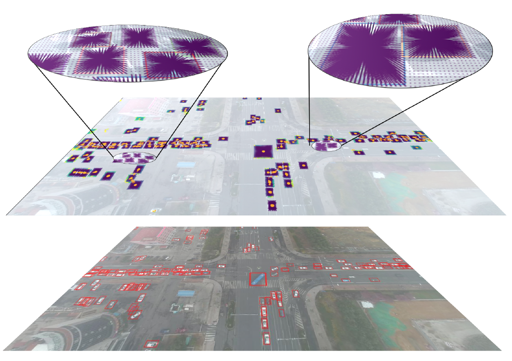
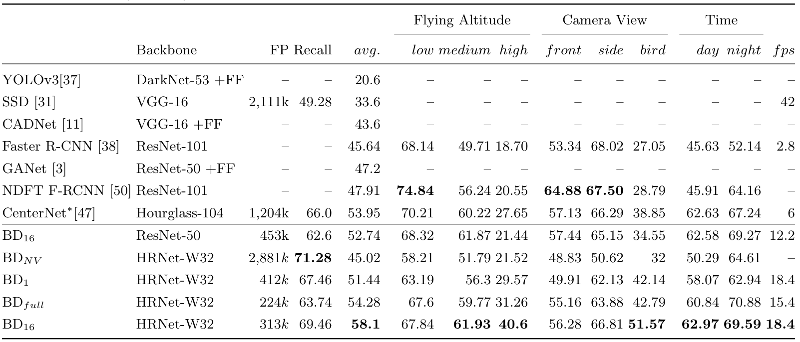

# Butterfly Detector

## Butterfly Detector for Aerial Images


> Current state-of-the-art object detectors have achieved high performance
> when applied to images captured by standard front facing cameras. When applied
> to high-resolution aerial images captured from a drone or UAV stand-point,
> they fail to generalize to the wide range of objects' scales. In order to
> address this limitation, we propose an object detection method called
> Butterfly Detector that is tailored to detect objects in aerial images. We
> extend the concept of fields and introduce butterfly fields, a type of
> composite field that describes the spatial information of output features as
> well as the scale of the detected object. To overcome occlusion and viewing
> angle variations that can hinder the localization process, we employ a voting
> mechanism between related butterfly vectors pointing to the object center. We
> evaluate our Butterfly Detector on two publicly available UAV datasets
> (UAVDT and VisDrone2019) and show that it outperforms previous state-of-the-art
> methods while remaining real-time.

# Demo

<!--Solarized dark                                                                               |  Solarized Ocean
:-------------------------------------------------------------------------------------------:|:-------------------------:
  |  -->
 
<!---->

### Setup

Python 3 is required. Python 2 is not supported.
Do not clone this repository
and make sure there is no folder named `butterflydetector` in your current directory.

```sh
pip3 install butterflydetector
```

For development of the butterflydetector source code itself, you need to clone this repository and then:

```sh
pip3 install numpy cython
pip3 install --editable '.[train,test]'
```

The last command installs the Python package in the current directory
(signified by the dot) with the optional dependencies needed for training and
testing.

### Data structure

    data         
    ├── UAV-benchmark-M
        ├── test
        ├── train
    ├── VisDrone2019
        ├── VisDrone2019-DET-train
            ├── annotations
            ├── images
        ├── VisDrone2019-DET-val
        ├── VisDrone2019-DET-test-dev

# Interfaces

* `python3 -m butterflydetector.predict --help`
* `python3 -m butterflydetector.train --help`
* `python3 -m butterflydetector.eval --help`
* `python3 -m butterflydetector.logs --help`

Tools to work with models:

* `python3 -m butterflydetector.migrate --help`


# Benchmark
Comparison of AP (%), False Positives (FP), and Recall (%) with state-of-the-art methods on UAVDT datasets.


Comparison of AP (average precision), AR (average recall), True Posi-tives (TP), and False Positives (FP) with state-of-the-art methods on VisDronedataset


# Visualization

To visualize logs:

```sh
python3 -m butterflydetector.logs \
  outputs/resnet50block5-pif-paf-edge401-190424-122009.pkl.log \
  outputs/resnet101block5-pif-paf-edge401-190412-151013.pkl.log \
  outputs/resnet152block5-pif-paf-edge401-190412-121848.pkl.log
```


# Train

See [datasets](docs/datasets.md) for setup instructions.

The exact training command that was used for a model is in the first
line of the training log file.

Train a HRNetW32-det model on the VisDrone Dataset:

```sh
time CUDA_VISIBLE_DEVICES=0,1 python3 -m butterflydetector.train \
  --lr=1e-3 \
  --momentum=0.95 \
  --epochs=150 \
  --lr-decay 120 140 \
  --batch-size=16 \
  --basenet=hrnetw32det \
  --head-quad=1 \
  --headnets butterfly10 \
  --square-edge=512 \
  --lambdas 1 1 1 1 \
  --dataset visdrone
```

You can refine an existing model with the `--checkpoint` option.

# Evaluation

# Video

Processing a video frame by frame from `video.avi` to `video.pose.mp4` using ffmpeg:

```sh
export VIDEO=video.avi  # change to your video file

mkdir ${VIDEO}.images
ffmpeg -i ${VIDEO} -qscale:v 2 -vf scale=641:-1 -f image2 ${VIDEO}.images/%05d.jpg
python3 -m butterflydetector.predict --checkpoint resnet152 --glob "${VIDEO}.images/*.jpg"
ffmpeg -framerate 24 -pattern_type glob -i ${VIDEO}.images/'*.jpg.skeleton.png' -vf scale=640:-2 -c:v libx264 -pix_fmt yuv420p ${VIDEO}.pose.mp4
```

In this process, ffmpeg scales the video to `641px` which can be adjusted.


<!--# Documentation Pages

* [datasets](docs/datasets.md)
* [Google Colab demo](https://colab.research.google.com/drive/1H8T4ZE6wc0A9xJE4oGnhgHpUpAH5HL7W)
* [studies.ipynb](docs/studies.ipynb)
* [evaluation logs](docs/eval_logs.md)
* [performance analysis](docs/performance.md)-->

# Citation

```
@misc{adaimi2020perceiving,
      title={Perceiving Traffic from Aerial Images}, 
      author={George Adaimi and Sven Kreiss and Alexandre Alahi},
      year={2020},
      eprint={2009.07611},
      archivePrefix={arXiv},
      primaryClass={cs.CV}
}
```
